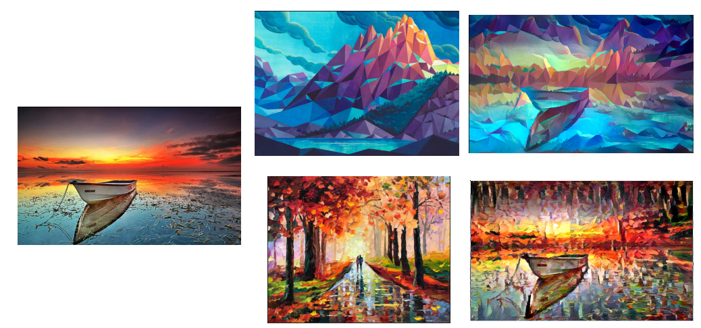

# DeepLearning-NeuralStyleTransfer

* [Summary Of What I've Learned](https://github.com/kvong/DeepLearning-NeuralStyleTransfer/blob/master/NeuralStyleTransfer.pdf)

* Some images I generated:
    
    
* Refining the image:
    
   * Without Content Mask
    
   * With Content Mask
    

* References from:
  * Deep Learning with Python by François Chollet
  * [Original Paper](https://arxiv.org/pdf/1508.06576.pdf)
  * [How to Get Beautiful Results With Neural Style Transfer](https://towardsdatascience.com/how-to-get-beautiful-results-with-neural-style-transfer-75d0c05d6489)
  * [Paper About Using Masks To Preserve Content/Style](http://cs231n.stanford.edu/reports/2016/pdfs/208_Report.pdf)
* Code Based On:
  * [Official Code From Keras](https://keras.io/examples/neural_style_transfer/)
  * [Masked Content Code From titu1994](https://github.com/titu1994/Neural-Style-Transfer)
